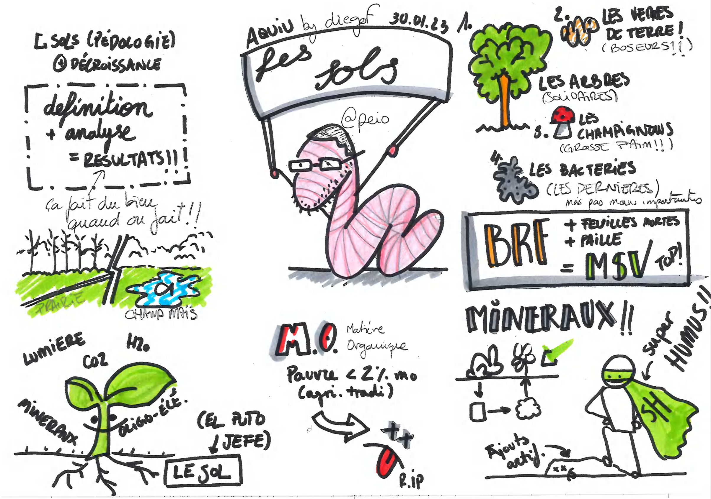

# Et si on parlait des sols

Présentation faite au meetup [Degrowth Hacking Pau](https://www.meetup.com/degrowth-hacking-pau/)

Accessible en ligne: https://presentation-sols.netlify.app

Modifications et corrections bienvenues !

  
  <i>(sketchnote réalisée par Diego (@dfelipe64)</i>

## Build

- Installer [NodeJS](https://nodejs.org/) (idéalement via [nvm](https://github.com/nvm-sh/nvm))
- `npm install`
- `npm run dev`

## Déploiement

Pour la production: `npm run build` puis déployer le contenu du répertoire `./dist/`

## PDF

`npm run export` pour générer une version `pdf`

